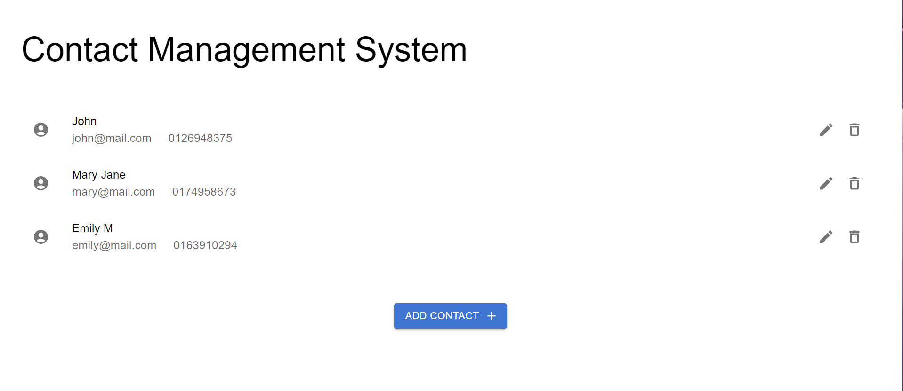

### Contact Management System (CMS)

---

The CMS is built to simulate a simple system that helps organise contact information for various users. It has both a frontend and a backend which are explained as follows

**Backend**:
The backend serves as the engine powering the CMS. It utilises the Model, View, Controller (MVC) architecture to perform create, read, update, and delete (CRUD) operations on contacts. Built on Node JS and Express JS, RESTful APIs are implemented to provide contact management functionality to clients that may consume it. Additionally, the Prisma Object Relational Mapper (ORM) is added as a dependency to streamline CRUD operations for a database of choice such as SQLite.

Core dependencies used:

- Express
- Prisma ORM
- dotenv
- CORS
- Zod

**Frontend**:
The frontend presents a simple user interface that allows users to easily perform CRUD operations on contacts. A single-page application was built using React JS to ensure seamless asynchronous tasks. It communicates with the backend via API endpoints. A sample of the user interface is shown below:

Core dependencies used:

- React
- Axios
- Material UI (MUI)

### Setup and API Usage

---

Clone the git repository and cd into the project folder. Notice the `backend` and `client` directories, these contain both the backend and frontend code respectively.

```
$ git clone https://github.com/AT-LOW45/contact-management-system.git
$ cd contact-management-system
```

Since the project is divided as such, you will need to open a separate terminal to run both codebase simultaneously.

```
// start backend server
$ cd backend
$ npm install
$ npm run serve
```

On a separate terminal window, run:

```
// start client server
$ cd client
$ npm install
$ npm run dev
```

Once the client server is running, navigate to http://localhost:5173/ using your browser of choice to test the UI.

Regarding the backend, I recommend using Postman to test the API responses. the available endpoints are:

#### Get all contacts

`http://localhost:8000/contact (GET)`

This endpoint fetches all available contacts saved in the database. For a successful response (status code 200), you will receive JSON data similar to the following:

```
[
  {
  "id": 8,
  "name": "John",
  "email": "john@mail.com",
  "phone_number": "0126948375"
  },
{
  "id": 9,
  "name": "Mary Jane",
  "email": "mary@mail.com",
  "phone_number": "0174958673"
  },
{
  "id": 10,
  "name": "Emily M",
  "email": "emily@mail.com",
  "phone_number": "0163910294"
  }
]
```

#### Create new contact

`http://localhost:8000/contact (POST)`

This endpoint creates a new contact entry in the database via a POST request. For a successful response, you will receive a success message along with the ID of the newly created contact

#### Update existing contact

`http://localhost:8000/contact/:contactId (PUT)`

This endpoint updates the existing contact by matching the provided `contactId` param with database records. If the contact does not exist, the endpoint returns a 404 status code. Otherwise, an update success message is returned

#### Delete contact

`http://localhost:8000/contact/:contactId (DELETE)`

This endpoint deletes the contact that matches the provided `contactId`. Similar to updating a contact, a success message is returned for a successful deletion, otherwise a 404 status code is returned
